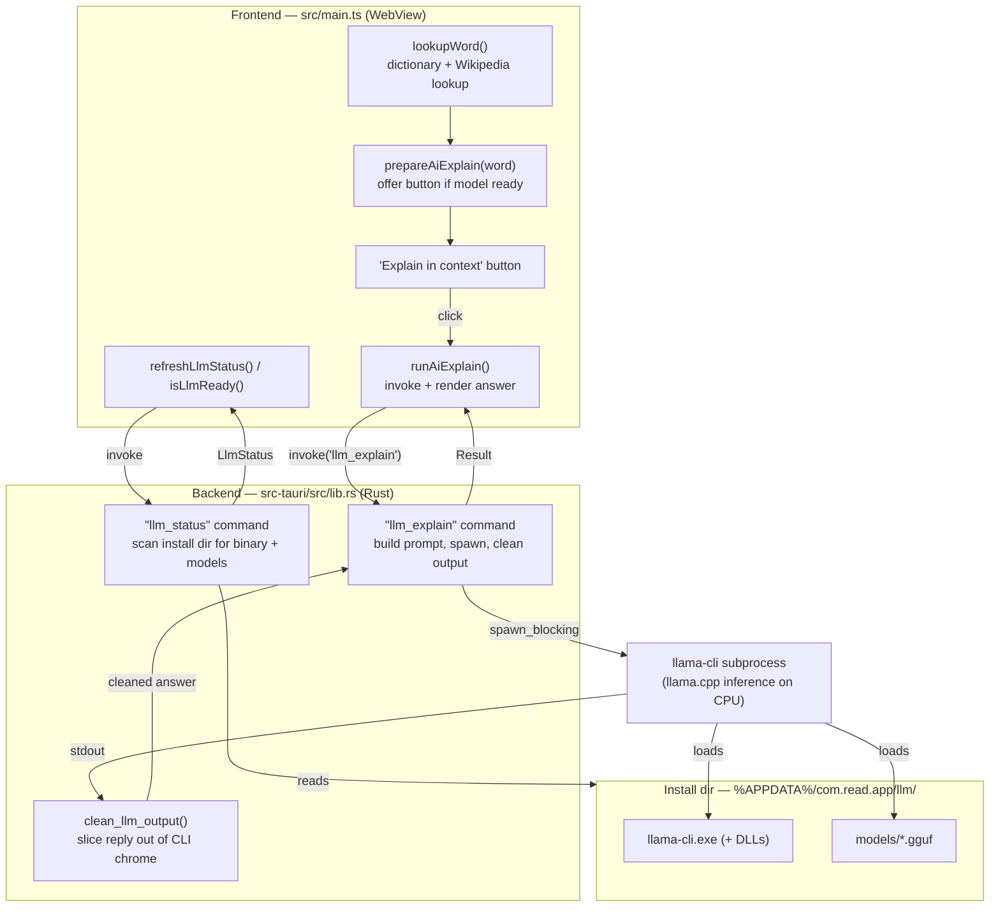
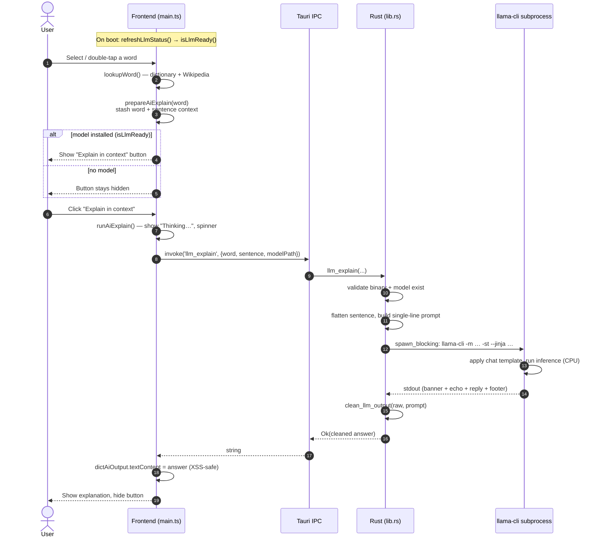
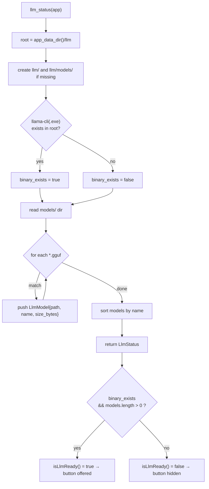
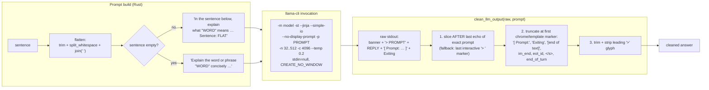
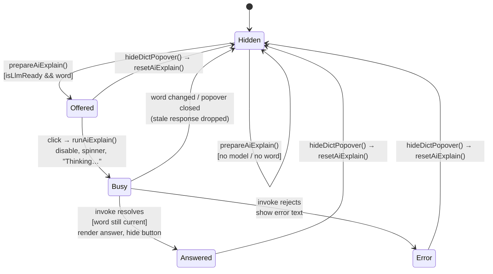

# Smart Dictionary — AI "Explain in Context" Architecture

Technical documentation for the local‑LLM word‑meaning feature added to **Read**.

When a reader looks up a word, the app shows the usual dictionary/Wikipedia
definition **and**, if a local model is installed, offers an **"Explain in
context"** button. Clicking it runs a small instruction‑tuned LLM entirely on
the user's machine to explain what the word means *as it is used in that
sentence* — disambiguating senses, handling idioms and technical terms, and
working even when the device is fully offline.

- **Frontend:** TypeScript / Vite single‑page app (`src/main.ts`)
- **Backend:** Rust, Tauri v2 (`src-tauri/src/lib.rs`)
- **Inference:** bundled `llama-cli` (llama.cpp) subprocess + a GGUF model
- **Model (reference):** Qwen2.5‑1.5B‑Instruct, Q4_K_M (~1.1 GB), ChatML template

---

## 1. Component overview



The design deliberately mirrors the app's existing **Piper TTS** integration:
same install root under `app_data_dir()`, same `spawn_blocking` +
`CREATE_NO_WINDOW` subprocess pattern, same status‑scan approach.

---

## 2. End‑to‑end request flow



Two properties fall out of this flow:

- **Stale‑response guard.** `runAiExplain()` captures the `word` at click time
  and, when the answer arrives, only renders it if `aiExplainWord === word`. If
  the reader moved on to another word (or closed the popover, which calls
  `resetAiExplain()`), the late answer is dropped.
- **Non‑blocking UI.** A 1–2 B model on CPU takes a few seconds. The Rust
  command is `async` and does the actual work inside
  `tauri::async_runtime::spawn_blocking`, so the WebView thread never stalls.

---

## 3. Model / binary discovery (`llm_status`)

`llm_status` is what makes the feature *conditional* — the UI only ever offers
the button when this scan confirms a working install.



`LlmStatus` shape (serialized to the frontend):

| Field           | Type          | Meaning                                        |
| --------------- | ------------- | ---------------------------------------------- |
| `binary_exists` | `bool`        | `llama-cli(.exe)` present in the install root  |
| `binary_path`   | `string`      | Absolute path to the binary                    |
| `models_dir`    | `string`      | Absolute path to `llm/models/`                 |
| `models`        | `LlmModel[]`  | One entry per `.gguf` found                    |

`LlmModel` = `{ path, name, size_bytes }`. `path` is passed back **verbatim** as
`modelPath` on the next `llm_explain` call — the frontend never constructs
paths itself. Currently `runAiExplain()` uses `models[0]` (first model,
alphabetically).

---

## 4. Prompt construction & output cleaning

The subtlest part of the pipeline. This llama.cpp build prints a startup
**banner**, **echoes the prompt** (prefixed `> `), then the reply, then a stats
**footer** (`[ Prompt: … ]`) and `Exiting…` — all on **stdout**, even with
`--no-display-prompt`. So the raw stdout is *not* just the answer.



Why slice on the echoed prompt rather than blocklist banner lines? **We know the
exact prompt string we sent**, so the reply is reliably the text *after* the
last echo of that prompt and *before* the `[ Prompt:` footer. That boundary
survives banner/format changes across llama.cpp builds far better than trying to
enumerate banner lines. The prompt is kept to a **single line** (sentence
whitespace collapsed) precisely so the CLI echoes it verbatim and the slice is
exact.

Key invocation flags:

| Flag                  | Purpose                                                        |
| --------------------- | ------------------------------------------------------------- |
| `-st` / `--single-turn` | One user turn, then exit — no interactive loop               |
| `--jinja`             | Apply the model's **embedded** chat template (ChatML for Qwen)|
| `--simple-io`         | Plain IO for subprocesses — no ANSI/cursor escape codes       |
| `--no-display-prompt` | Ask the CLI not to echo (honored by *some* builds)            |
| `-n 200` (32–512)     | Max predicted tokens; clamped from `max_tokens`               |
| `-c 4096`             | Context window                                                |
| `--temp 0.2`          | Low temperature — factual, low‑variance explanations          |
| `stdin = null`        | A build that ignores `-st` gets EOF and exits, never hangs    |

`clean_llm_output` is locked in by **3 unit tests** in `lib.rs`
(`extracts_reply_between_prompt_echo_and_footer`,
`strips_template_tokens_when_prompt_absent`,
`falls_back_to_interactive_marker`).

---

## 5. Frontend button state machine



The answer is written with `el.dictAiOutput.textContent = answer` — never
`innerHTML` — so model output can never inject markup into the page. The button
hides itself after answering because a second click would just regenerate the
same explanation.

---

## 6. Install layout

```
%APPDATA%/com.read.app/llm/          ← llm_root(app)
├── llama-cli.exe                     ← llm_binary(root)  (Windows)
├── *.dll                             ← llama.cpp runtime DLLs
└── models/
    └── qwen2.5-1.5b-instruct-q4_k_m.gguf
```

- **App identifier:** `com.read.app` (productName "Read")
- `app_data_dir()` resolves to `%APPDATA%/com.read.app/` on Windows.
- The binary is bundled/installed alongside the model; the model file(s) live in
  `models/`. Any `.gguf` dropped there is auto‑discovered on the next
  `llm_status` scan.

---

## 7. Design notes & known limitations

- **Fully offline.** Once the binary + model are installed, the feature needs no
  network. It is the *only* dictionary path that still works with no connection —
  hence `prepareAiExplain()` is called even on the offline/"no result" branch of
  `lookupWord()`.
- **Cold‑load per call.** Each `llm_explain` spawns a fresh `llama-cli` process
  that loads the ~1 GB model from disk before generating. First‑token latency is
  dominated by this load. A persistent `llama-server` would amortize it — the
  natural next step past prototype.
- **No streaming yet.** The command returns the whole answer at once; the UI
  shows a static "Thinking…" until it resolves. Token streaming over Tauri
  events is a planned enhancement.
- **Model‑quality ceiling.** A 1.5 B model occasionally paraphrases rather than
  truly explains (e.g. it disambiguated "bank → river's edge" well, but
  paraphrased a harder example). This is a model‑size trade‑off, not a pipeline
  bug; a larger GGUF can be dropped into `models/` without code changes.

---

## 8. Extending the pipeline

Because discovery is directory‑based and inference is a plain subprocess, the
feature extends without frontend churn:

- **Swap/add models** → drop a `.gguf` into `llm/models/`; it appears on the next
  `llm_status`. (Add UI model‑selection to move past `models[0]`.)
- **New AI actions** (summarize passage, simplify sentence, translate) → add a
  sibling Rust command that reuses the same prompt‑build + `clean_llm_output`
  path with a different instruction template.
- **Ask‑the‑Book (RAG)** → the same `llama-cli` install serves as the generation
  backend; add an embedding + retrieval layer over the EPUB text.
